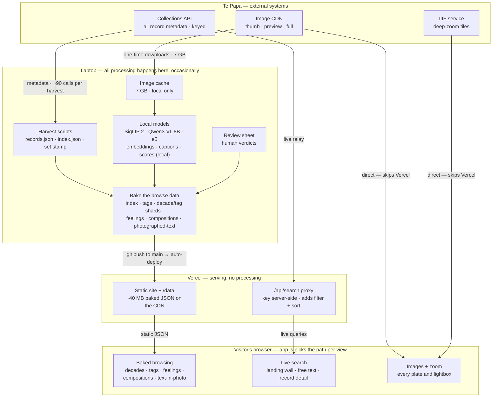

# Architecture: where data lives, where processing happens

*Companion to [image-tagging.md](image-tagging.md). The one idea that explains
most of the system: every photograph's metadata lives in **two parallel
worlds** — a live one and a baked one — and images travel a third path that
bypasses us entirely.*

## The picture

## The two worlds (and the third path)

**Live.** Search and the landing wall query Te Papa's Collections API in real
time through the thin `/api/search` proxy. The proxy's only jobs: keep
`TEPAPA_API_KEY` server-side, add the constant object filter and
quality-score sort, and let Vercel's edge cache popular queries. Records
arrive fresh — a new field in the API is simply *there*.

**Baked.** Everything else — decades, tags, feelings, compositions,
photographed-text search — never touches the API. Those views read
pre-built JSON committed to the repo and served as dumb static files.
That's why they're instant, and why they'd keep working if the API went
down. The cost: any *new field* must be woven through the
harvest → bake → shard chain and re-committed. (This is why swapping the
wall number for the registration number was a data change, not a one-line
UI tweak: live records already carried `identifier`; every baked file had
to learn it.)

**Direct.** Pixels never pass through us. Plates and the lightbox load from
`media.tepapa.govt.nz` (which redirects to S3 — the CSP allows it), and
deep zoom tiles come from `iiif.tepapa.govt.nz`. Vercel serves JSON and
code, never images.

## What is stored where

| store | lives | committed? |
|---|---|---|
| `build/records.json` — full harvest incl. embedding text | laptop | no (gitignored) |
| Image cache — 1.6 GB thumbs + 5.5 GB previews | laptop | no |
| ML artifacts — embeddings, captions.jsonl, tag scores | laptop | no (evidence files like benchmark results *are* committed) |
| `public/data/index.json` — 54k lean records (~13 MB) | repo → Vercel CDN | yes |
| `public/data/decade/` + `tag/` — 19 + 1,000 shards (~26 MB) | repo → Vercel CDN | yes |
| `emotions.json` · `compositions.json` · `transcripts.json` · `tags.json` | repo → Vercel CDN | yes |
| `TEPAPA_API_KEY` | `.env` locally · Vercel env var | never |
| Images in production | Te Papa's CDN only | — |

Two lineages are deliberately protected: **your verdicts** (per-model verdict
files; the July originals are never overwritten) and the **record-set stamp**
(sha1 of the ordered id list). Every baked artifact carries the stamp, and
every build script refuses to mix harvests — which is also why enrichment
joins (like the registration backfill) are preferred over re-harvests: a
re-harvest changes the set and invalidates the whole embedding chain.

## Where processing happens

- **Laptop, occasionally** — everything heavy: harvest, downloads, all model
  inference, scoring, agreement, shard building. Bulky intermediates stay
  local; only distilled JSON is committed.
- **Vercel, never** — static serving plus the proxy relay. No compute.
- **Browser, a little** — `app.js` is the switchboard: picks live vs baked
  per view, filters decades client-side, shuffles the landing wall, runs the
  infinite scroll and lightbox.

## Rule of thumb for changes

| kind of change | cost |
|---|---|
| Look or behaviour (CSS, app.js) | one edit + cache-bust bump |
| What baked pages know about each photo | build-pipeline pass + data re-commit (minutes, if no re-harvest) |
| Fresh-from-the-museum data | belongs on the live path via the proxy |
| Anything changing the record set | full regeneration chain — the stamp will make stale artifacts refuse to run |
